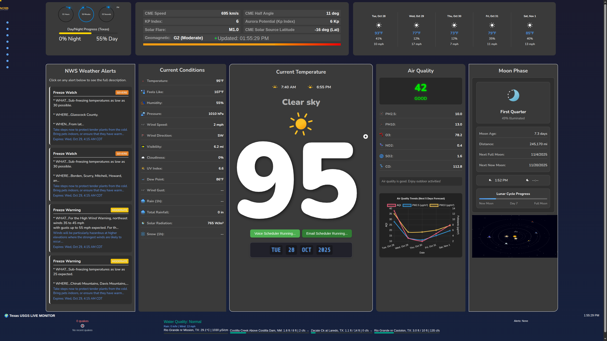

### 🔊 Listen to the Weather Sample

[**Click Here to Hear the Voice Sample**](https://raw.githubusercontent.com/uc-labs-llc/weatherdash/main/weather.m4a)

🌎 The Terrestrial & Celestial Nexus Dashboard

1. Project Overview: The All-In-One Environmental Monitor

The Terrestrial & Celestial Nexus is a real-time, cross-domain monitoring system designed to provide a unified view of every major force impacting daily life—from hyperlocal weather and air quality to global geological and space events.

This system moves beyond conventional weather reporting by integrating atmospheric, hydrological, geological, and astronomical data from over five distinct APIs and libraries into one cohesive, interactive interface. The goal is to provide unparalleled situational awareness for both immediate environmental safety and long-term planetary insight.

2. Core Dashboard Features

The dashboard is organized into interactive panels, ensuring a logical flow from local, personal data to global and celestial dynamics.

☀️ Local & Atmospheric Conditions

This section focuses on data essential for daily planning and immediate safety.

Feature

Data Source(s)

Functionality

Time & Day/Night Progress

Internal Clock & SunCalc

Displays the unique local time and a visual progress bar indicating the fraction of daylight remaining, providing immediate context for the diurnal cycle.

5-Day Weather Forecast

OpenWeatherMap

Standard multi-day forecast.

Enriched Environmental Data

OWM and Visual Crossing

Displays standard OWM elements alongside critical, synthesized metrics: Total Daily Rainfall and Daily Solar Radiation.

Full AQI Data & Forecast

Dedicated AQI API

Comprehensive Air Quality Index data, including pollutant levels and a forecast graph of expected air quality changes.

NWS Weather Alerts

NWS (National Weather Service)

Real-time severe weather alerts (e.g., flood, severe weather, heat) geographically tailored to the user's location.

CME Event Tracker

NOAA/NASA (Space Weather)

Tracks current and forecast Coronal Mass Ejection (CME) events from the Sun, alerting users to potential space weather impacts on technology and infrastructure.

🌕 Celestial and Astronomical Data

This advanced panel provides real-time orbital and positional data for both the Moon and the entire Solar System.

Moon Phase and Age: Displays the current phase, illumination percentage, and the exact age of the moon (days since new moon) using the SunCalc library.

Real-Time Moon Position: Plots the Moon's exact position across the local sky, with positional updates occurring every minute for precise tracking.

Solar System and Sun Plot: A real-time, dynamic 2D visualization that accurately plots the geometric location of the Sun and all major planets in real time, leveraging astronomical ephemeris data.

🏞️ Terrestrial & Geological Reporting

This section integrates critical Earth monitoring systems that detail geological activity, water resources, and environmental hazards.

Hydrological Monitoring (USGS): Live data on local River Flow, Flood Status, Water Temperature, and Conductance for nearby streams and rivers.

Earthquake Mapper (USGS): Displays the current count of global earthquakes. This element is clickable, opening an interactive map for detailed visualization of recent epicenters, magnitudes, and depth.

Contaminated Sites Mapper: Dedicated interactive map and query interface for local and regional environmental hazard sites.

Satellite Tracker: Displays the real-time orbital path and location of tracked satellites on a map. Includes robust search, sorting, and click-to-view functionality for full information profiles.

3. Technical Stack & Data Synthesis

The system's innovation lies in its capacity for high-volume, asynchronous data integration.

Front-end: Built as a single-page application using vanilla JavaScript, HTML5, and Tailwind CSS for cross-device responsiveness.

Core Libraries: The SunCalc library is foundational for all celestial position and phase calculations.

Multi-API Reconciliation: The dashboard successfully reconciles disparate data formats from multiple sources (OWM, Visual Crossing, NWS, USGS, Space Weather APIs), ensuring data freshness and consistency across the entire system.

Real-time Updates: Key elements, such as the Moon's position and planetary plots, are calculated and updated every minute, providing a truly live experience.

4. Voice Announcer Description

The voice announcer utilizes the browser's native Speech Synthesis API (speakNatively), which means it uses your computer's built-in text-to-speech function—no external audio files are needed.

 The script automatically starts when the dashboard loads and is scheduled to calculate the delay until the next absolute clock time, ensuring announcements fire perfectly at the top of the hour (:00) and at the half-hour mark (:30), and then repeats every 30 minutes. 

It reads several key dashboard metrics aloud, generating a phrase that typically says, "Weather conditions update: The current temperature is [Temperature] degrees Fahrenheit, Humidity is [Humidity] percent, Wind speed is [Wind Speed] miles per hour, Barometric pressure is [Pressure] hectopascals, The Dew Point is [Dew Point] degrees, and The UV Index is [UV Index]."

5. Setup and Run Instructions

The dashboard requires a modern web browser to execute the client-side JavaScript that handles all API communication and rendering.

Dependencies: Ensure all required libraries (SunCalc, mapping libraries, etc.) are loaded via their respective CDNs as configured in the main HTML file.

API Keys: Configure the required API keysand email  (OpenWeatherMap, Visual Crossing, etc.) in the designated areas of the api-key.js and email-config.php.

NWS-ALERTS: change the state here in nws-alerts.js ;
 class NWSAlert {
    constructor(containerId, options = {}) {
        this.container = document.getElementById(containerId);
        this.options = {
            state: 'TX', // Texas
            refreshInterval: options.refreshInterval || 300000, // 5 minutes
            maxAlerts: options.maxAlerts || 4,
            ...options
        };

CME Data Synchronization (CORS Bypass)
The Coronal Mass Ejection (CME) data displayed on the dashboard, along with other specialized solar physics metrics, is sourced directly from NASA and other scientific databases. When a web browser attempts to directly fetch this data from an external domain, it often encounters CORS (Cross-Origin Resource Sharing) restrictions. This browser-enforced security mechanism prevents the data from being loaded into our dashboard's local environment. To effectively bypass this security policy without requiring a complex, full-scale proxy server, we rely on a manual, server-side data extraction method.
This method involves running a dedicated Python script, such as fetch_nasa_data.py, on the server or a local machine that hosts the dashboard files. Since the script executes outside of the browser, it is not subject to CORS limitations. This script fetches the necessary data, processes it, and saves it to a local JSON file that the dashboard can then load without issue. To ensure the space weather metrics are consistently up-to-date, this script must be run regularly, either manually or via a scheduled process like a cron job.
Example Cron Job Setup
If you are running the dashboard on a Linux or Unix-like environment (like a Raspberry Pi or cloud server), you can automate the script's execution using crontab. This simple example will execute your Python script every 30 minutes:
# This line runs the fetch_nasa_data.py script every hour at :00 and :30 minutes.
# Make sure to adjust the path (/path/to/script/) and the Python environment (python3).
0,30 * * * * /usr/bin/python3 /path/to/script/fetch_nasa_data.py
This cron setup guarantees that the CME values are refreshed on a regular basis, keeping your dashboard current without requiring any additional user interaction or complex server infrastructure.

Launch: Simply open the index.html file in any modern web browser.

Note: Due to the scope of external API calls, optimal performance is achieved when running through a local development server.

Simulating the Real-World IoT -- irrigation.html

This demo is a functional proof-of-concept for a sophisticated, data-driven utility system. In a production environment, the JavaScript functions currently generating random numbers for water usage and calculating cost would be replaced by authenticated API calls fetching data from actual physical sensors and cloud services:

Input Integration: The current "Rainfall Input" field, which you manually adjust, would instead make a secure, real-time request to a commercial weather service (like the one feeding the index.html dashboard) or a local rain gauge sensor connected via Wi-Fi. The controller would automatically ingest that data and use it for its conservation logic.

Actuator Control: When you click the "Check Rainfall & Activate" button, the code currently runs a simulation function. In reality, this action would trigger an encrypted message sent through a cloud platform (like Google Cloud IoT Core or AWS IoT) to a physical smart solenoid valve—the actuator—that actually opens or closes the water line.

Metrics and Costing: The Gallons Used and Running Cost metrics, which are currently updated via a simple browser setInterval, would be derived from a real-time flow meter and a secure database recording timestamps, enabling accurate billing and usage auditing.

The Value of the Demo Structure
The architecture of this irrigation.html demo, with its separate controls and a persistent data display, demonstrates the three core capabilities necessary for operational oversight: Monitoring, Control, and Reporting.

By setting up this simulation with real-world inputs (like flow rate and cost per gallon) and fixed-position panels that mimic application windows, you have created a tangible prototype. It's built to be updated: switch the data source from localStorage to a Firestore database or a custom cloud endpoint, and you instantly have a fully operational, multi-user IoT application ready for deployment.
